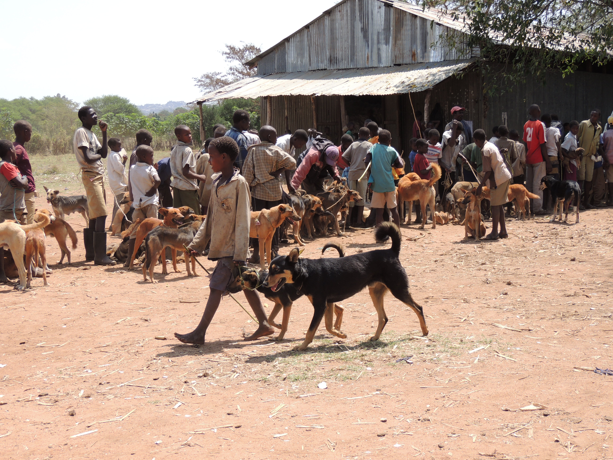

<ol class="breadcrumb" style="background-color:white;">
  <li class="breadcrumb-item"><a href="index.html">Home</a></li>
  <li class="breadcrumb-item active">Dog Vaccination</li>
</ol>

# Dog Vaccination

Worldwide, around 60,000 human rabies deaths occur annually. Although the virus is transmitted by a wide range of mammals, a large proportion of these deaths are from the bites of infected domestic dogs. Rabies can be effectively controlled by implementing high coverage and comprehensive dog vaccination programmes.  
  
Our team has supported the local government in Serengeti District in conducting domestic dog vaccination campaigns in Serengeti District since 2003, using a [central point strategy](https://www.sciencedirect.com/science/article/pii/S0264410X08013078?via%3Dihub). Over this time period, we have increased the number of villages included in campaigns, and the number of dogs vaccinated.  
  
Scroll down for data on dog vaccination campaigns, including maps of villages covered.  

<center>




</center>

<br>

***  

### Data {.tabset .tabset-pills}  
  
#### Serengeti: 2002 - present (annual)  
```{r, echo=FALSE, warning=FALSE}
start_date <- "2001-12-31"
end_date <- Sys.Date()
dog_vac_barplot(dataframe=dog_vacc_data, type="all", start_date=start_date, end_date=end_date)
```
  
<br>
  
*** 

#### Serengeti: 2015 - present (monthly)  
```{r, echo=FALSE, warning=FALSE}
start_date <- "2014-12-31"
end_date <- Sys.Date()
dog_vac_barplot(dataframe=dog_vacc_data_subset, type="subset", start_date=start_date,
                end_date=end_date)
```

<br>

***

### Village-level Vaccination Coverage  
  
The map details villages that were vaccinated (1 or more times) in Serengeti District from 2014-2018; where villages were visited multiple times in the same year, the date and Kitongoji (sub-village) are given. Select from the dropdown menu to view a specific year:  

```{r droplink, echo=FALSE}
# Create table
table_site <- c("html/ser_vacc_map_2018.html", "html/ser_vacc_map_2017.html",
                "html/ser_vacc_map_2016.html", "html/ser_vacc_map_2015.html",
                "html/ser_vacc_map_2014.html")
names(table_site) <- c("2018", "2017", "2016", "2015", "2014")

bsselect(table_site, type = "iframe", frame_height="550", style="btn-primary", show_tick=TRUE, height=0)
```
