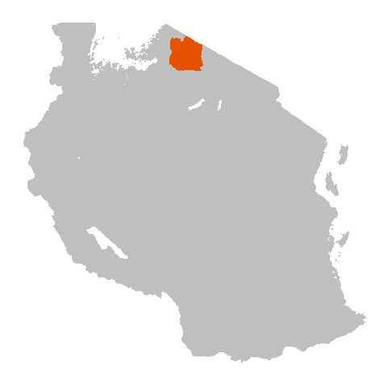

<ol class="breadcrumb" style="background-color:white;">
  <li class="breadcrumb-item"><a href="index.html">Home</a></li>
  <li class="breadcrumb-item active">Project Information</li>
</ol>

# Project Information

We carry out epidemiological and implementation research on rabies and its prevention and control in the Serengeti District of Mara region in Northwest Tanzania. We have a long-term contact tracing study ongoing in Serengeti District that began in 2002.  

Since the study began, we have traced `r format(ser_overview$n_suspect_animal, big.mark=",")` probable animal cases and `r format(ser_overview$n_suspect_human, big.mark=",")` probable human exposures in Serengeti District. We have also been able to generate `r format(ser_overview$n_positives, big.mark=",")` whole genome sequences of rabies viruses from the samples we have collected whilst contact tracing.   

We work with the local District Veterinary Office to implement dog vaccination campaigns. To see the impact that these dog vaccinations have had on circulating rabies cases and exposure risks, check out our [Vaccination](Ser_Vac_report.html) and [Epidemiology](Ser_Epi_report.html) pages. 

Full details of our publications are on google scholar. Links to publications from our research in Serengeti are available [here](Ser_publications.html) and links to our other publications on rabies are on our [hub](to_be_added.html).

 

Our work is generously supported by many organizations. If you would like more information, we can be contacted via the links at the top-right.    

  

