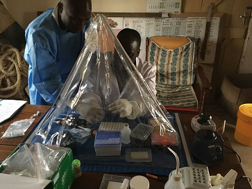

<ol class="breadcrumb" style="background-color:white;">
  <li class="breadcrumb-item"><a href="index.html">Home</a></li>
  <li class="breadcrumb-item"><a href="about_overview.html">Project Information</a></li>
  <li class="breadcrumb-item active">Rabies Epidemiology</li>
</ol>

# Rabies Epidemiology  
  
Rabies incidence has been estimated through exhaustive contact tracing in Serengeti District since 2002. Contact tracing involves identifying probable animal Rabies cases and probable human Rabies exposures, through interviews with witnesses and contacts. A brain tissue sample is also taken from the animal if located, for subsequent testing: a rapid diagnostic kit is used in-situ, with laboratory confirmation and whole genome sequencing completed later.  
  
[Click here](data_epi.html) to see our epidemiology data, including Rabies incidence over time, and maps of probable and lab-confirmed animal Rabies cases.  
  

