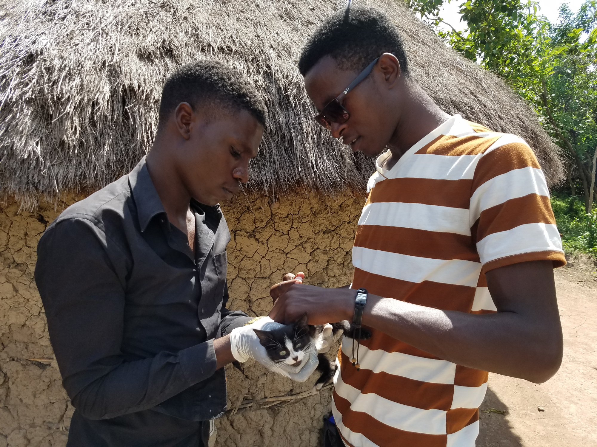
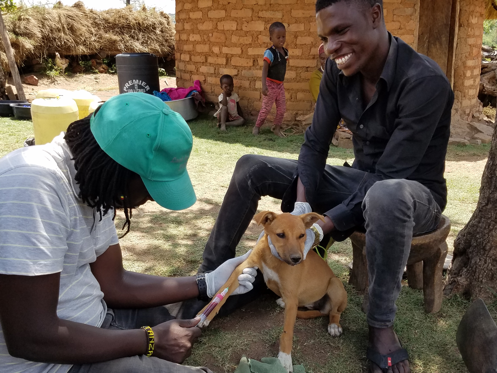
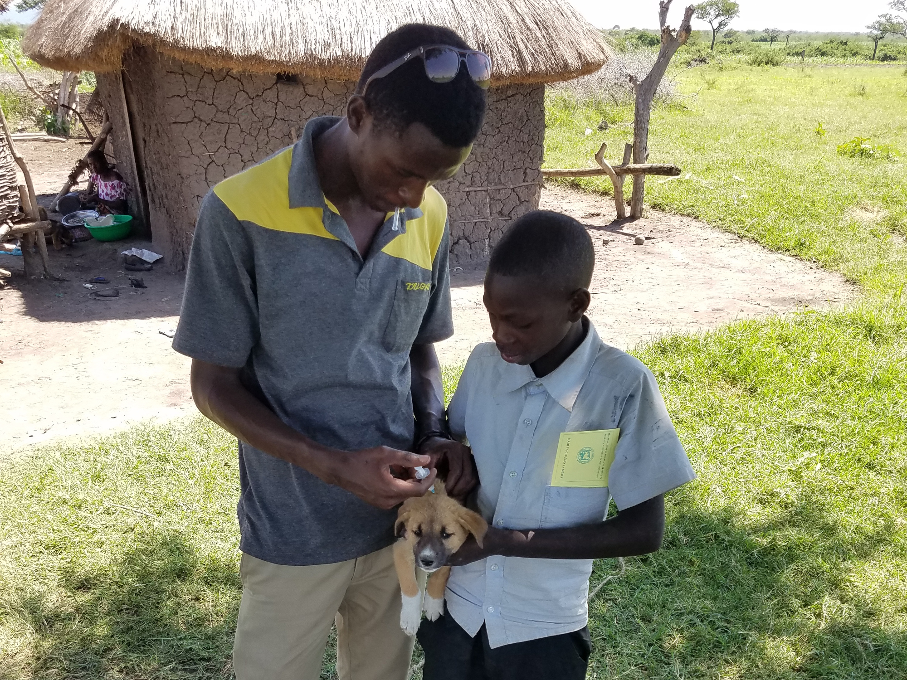
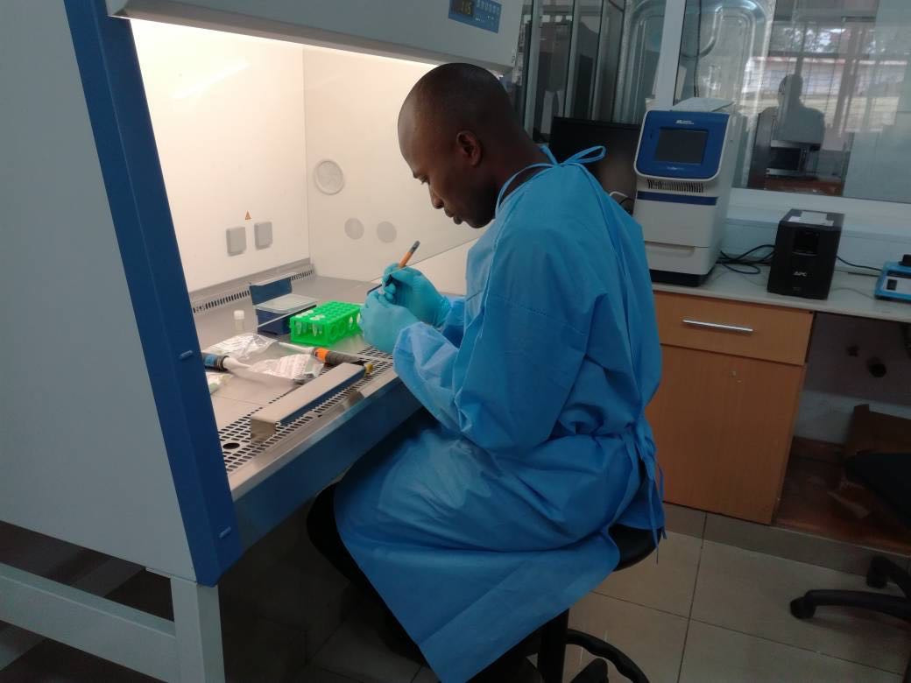

<!-- ---------------------------------------------------------------------- --!>
<!--Add javascript section for tabbed sections!-->

<body onload="document.getElementById('defaultOpen').click();">

<!-- ---------------------------------------------------------------------- --!>
<!--Add javascript section for lightbox!-->

<!-- ---------------------------------------------------------------------- --!>
<!--Add a loading bar!-->

<link href="pace_loadbar_loading.css" rel="stylesheet" />

<!-- ---------------------------------------------------------------------- --!>
<!-- Add icon library -->
<link rel="stylesheet" href="https://use.fontawesome.com/releases/v5.7.2/css/all.css" integrity="sha384-fnmOCqbTlWIlj8LyTjo7mOUStjsKC4pOpQbqyi7RrhN7udi9RwhKkMHpvLbHG9Sr" crossorigin="anonymous">
<!-- ---------------------------------------------------------------------- --!>
<!--Create a block for title and breadcrumbs to appear on same line-->

# Project Gallery

<ol class="breadcrumb" style="background-color:white;">
<li class="breadcrumb-item"><a href="index.html">Home</a></li>
<li class="breadcrumb-item active">Project Gallery</li>
</ol>

 

<!-- ---------------------------------------------------------------------- --!>
<!--Begin page content!-->

<!-- Tab links, with tab 1 by default -->
<button class="tablink" onclick="openPage('Vax', this, '#DE4815')" id="defaultOpen"><i class="fa fa-syringe"></i></button>
<button class="tablink" onclick="openPage('CT', this, '#DE4815')"><i class="fa fa-project-diagram"></i></button>
<button class="tablink" onclick="openPage('Lab', this, '#DE4815')"><i class="fa fa-vials"></i></button>

<!-- ---------------------------------------------------------------------- --!>
<!-- Tab 1 content -->

<h3>Dog Vaccination</h3>
<em>Please click on a photo to view</em>

<!-- Images used to open the lightbox -->

 <!-- End Gallery -->

<!-- The Modal/Lightbox -->

&times;

<!-- Images in Lightbox -->

1 / 12

2 / 12

3 / 12

4 / 12

5 / 12

6 / 12

7 / 12

8 / 12

9 / 12

10 / 12

11 / 12

12 / 12

<!-- Next/previous controls -->
<a class="prev" onclick="plusSlides(-1)">&#10094;</a>
<a class="next" onclick="plusSlides(1)">&#10095;</a>

<!-- Caption text -->

 <!-- End Caption -->

 <!-- End Modal content -->

 <!-- End Lightbox -->

 <!-- End Tab 1 -->

<!-- ---------------------------------------------------------------------- --!>
<!-- Tab 2 content -->

<h3>Contact Tracing</h3>
<em>Please click on a photo to view</em>

<!-- Images used to open the lightbox -->

 <!-- End Gallery -->

<!-- The Modal/Lightbox -->

&times;

<!-- Images in Lightbox -->

1 / 4

2 / 4

3 / 4

4 / 4

<!-- Next/previous controls -->
<a class="prev" onclick="plusSlides(-1)">&#10094;</a>
<a class="next" onclick="plusSlides(1)">&#10095;</a>

<!-- Caption text -->

 <!-- End Caption -->

 <!-- End Modal content -->

 <!-- End Lightbox -->

 <!-- End Tab 2 -->

<!-- ---------------------------------------------------------------------- --!>
<!-- Tab 3 content -->

<h3>Laboratory Analysis</h3>
<em>Please click on a photo to view</em>

<!-- Images used to open the lightbox -->

 <!-- End Gallery -->

<!-- The Modal/Lightbox -->

&times;

<!-- Images in Lightbox -->

1 / 3

2 / 3

3 / 3

<!-- Next/previous controls -->
<a class="prev" onclick="plusSlides(-1)">&#10094;</a>
<a class="next" onclick="plusSlides(1)">&#10095;</a>

<!-- Caption text -->

 <!-- End Caption -->

 <!-- End Modal content -->

 <!-- End Lightbox -->

 <!-- End Tab 3 -->
